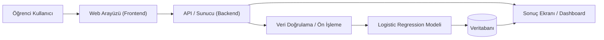
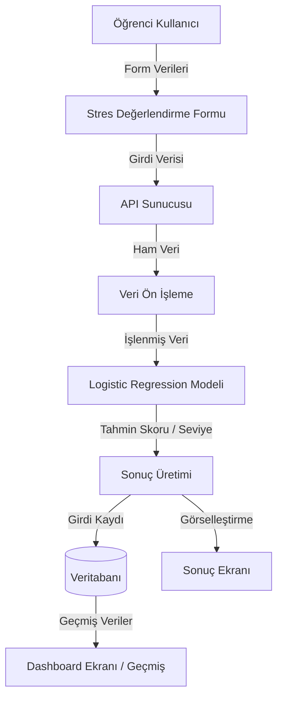
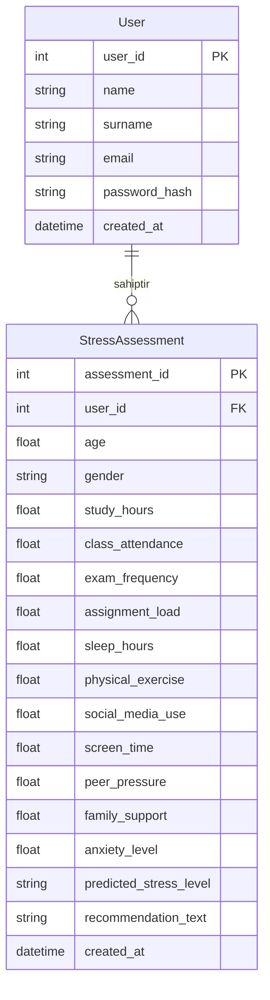
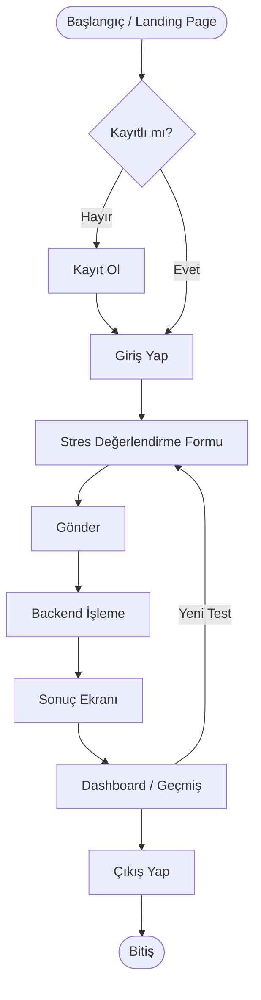

# Tez Yazılım / Sistem Diyagramları

Bu dosya, "Üniversite Öğrencileri İçin Yapay Zeka Destekli Stres Tahmin Sistemi" tezi için gerekli olan sistem mimarisi ve akış diyagramlarını Mermaid formatında içermektedir.

---

### Şekil 3.1. Sistem mimarisi diyagramı



---

### Şekil 3.2. Use Case diyagramı

```mermaid
useCaseDiagram
    actor Student as "Öğrenci Kullanıcı"
    
    package System {
        usecase UC1 as "Kayıt Ol"
        usecase UC2 as "Giriş Yap"
        usecase UC3 as "Stres Değerlendirme Formu Doldur"
        usecase UC4 as "Değerlendirmeyi Gönder"
        usecase UC5 as "Tahmin Edilen Stres Seviyesini Görüntüle"
        usecase UC6 as "Önerileri Görüntüle"
        usecase UC7 as "Geçmiş Kayıtları Görüntüle"
        usecase UC8 as "Dashboard / Trendleri Görüntüle"
        usecase UC9 as "Çıkış Yap"
    }
    
    Student --> UC1
    Student --> UC2
    Student --> UC3
    Student --> UC4
    Student --> UC5
    Student --> UC6
    Student --> UC7
    Student --> UC8
    Student --> UC9
```

---

### Şekil 3.3. Veri akış diyagramı (DFD)



---

### Şekil 3.4. Varlık-İlişki Diyagramı (ERD)



---

### Şekil 3.5. Kullanıcı akış şeması


